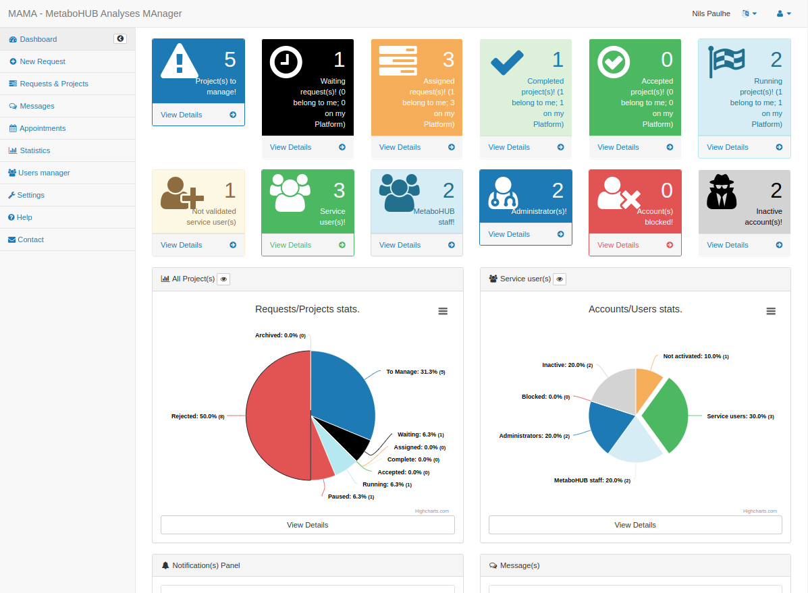

# Summary

<!-- Purpose & Motivation -->
The French National consortium "MetaboHUB" needed a tool to centralize, 
follow-up and compute indicators on submited analysis requests. \
<!-- Problem -->
No existing tool were sutable for this task so the consortium (bio)informatic team
initiate an in-house developements to fulfill these Features. \
<!-- Approach -->
We choose to develop a RESTful API <!--(using PHP-Slim) --> to centralize the core methods 
and a light WebApp  <!--(using Twitter-Bootrap and HighChart frameworks)--> to query it. \
<!-- Results -->
The MAMA (the **M**etaboHUB's **A**nalyses **MA**nager) tool is available since late 2016 
has been used to record more than 1500 analysis requests. \
<!-- Conclusion -->
Thanks its MIT License, everyone can fork and re-use these developements for its own need.

# Installation

To install and deploy a local MAMA instance server:
please, clone `mama-rest` and `mama-webapp` git repositories (option 1)
or just pull reference Docker images and run these services as Docker containers (option 2).

For both options you need a MySQL database (See MAMA documentation for recommanded version and configuration).

<!-- Code repository -->
For option one, please follow each repository `README.md` file instruction to
install and configure correctly third part tools, libraries and dependencies (Apache and PHP modules and versions). This option is recommanded if you want to fork the project and implement your own MAMA version.

<!-- Docker image -->
The option two is only recommended if you want to run the lastest version of the MAMA project. 
Warning: you need to update MAMA configuration files (`config/mama-config.ini` for `MAMA - REST` and `config/mama-webapp.json` for `MAMA WebApp`). We also advise to host configuration files on the server side and mount them into your Docker containers with `-v | --volumes` docker option or edit directly files in docker containers + `docker commit` changes. The Apache daemon must be restart to reload configuration updates in both containers).

# Statement of need

<!-- Data management at a lab scale -->
## Introduction

The MAMA team is working in the framework of the creation of a national network and infrastructure: MetaboHUB. MetaboHUB is the French National Facility in Metabolomics & Fluxomics created in 2013. It aims at providing state-of-the-art tools, services and support in metabolomics and fluxomics to academic research teams and industrial partners in the fields of nutrition, health, agriculture and biotechnology [@rolin:hal-01002241].

The idea of MAMA was born when the MetaboHUB consortium had to manage the flow of partner requests from a single portal. Building a specific tool based on a RESTful API and its WebApp gave birth to the "MAMA" project for "**M**etaboHUB's **A**nalyses **MA**nager". 

<!-- Project data management -->
## Project data management

The request was to provide a light WebApp to:
\begin{itemize}
    \item gather the consortium's partners requests (analyses, training, equipment provisioning, \ldots)
    \item split off requests on differents consortium geographical sites.
    \item exchange informations about submited requests; between partners and the consortium, and 
    between consortium nodes.
    \item compute indicators and statics for the consortium funders
\end{itemize}

The WebApp's graphical user interfaces for "Create new request" form has been designed to support 
Metabolomics analyses. The vocabulary and the data to submit is specific for this scientific field. 
The web-form statics input can not be easley customisable (static HTML code) however some data like
the consortium geographical sites or project's keywords are managed in the database; that allow MAMA's
administator to easely add or update these tags.

The last need for the consortium is to provide indicators and statistics to the French Research Agency
("ANR - Agence Nationale de la Recherche"), an institute that fund the MetaboHUB consortium. 
The main indicators are about the number of project per consortium node, the repatition of the projects
types, the projects providing sources, the thematic keywords repartitions, \ldots 
It is important for the consortium to track informations about "rejected analyses requests": this might 
help it to focus on new data of expertise to better answer metabolomics' community needs.

An XLS export with all projects and users indicators is also available; it allow to perform custom 
and advanced statistics using Microsoft Excel or LibreOffice softwares. 
Otherwise a developer can code a REST client to perform specific advanced statistics queryies calling
the REST API.

**Warning**: `MAMA` is just focus on the analyses **requests**. The analyses management in a laboratory 
shall be managed using a "Laboratory Information Management System" software (LIMS). 
Still, MetaboHUB's consortium in-house LIMS softwares can exchange informations with `MAMA REST API`.

As mentionned, we split the project in three layers

\begin{itemize}
    \item a MySQL database, used to store, organize, and manage software's data.
    \item a REST API, the real "Core" of MAMA software, that process every queries.
    \item a WebApp, light client of this REST API, used to provide a user-friendly GUI.
\end{itemize}

<!-- Portal with internal/external collaborator -->
## Portal with internal/external collaborator

The WebApp is a bridge between our final users (biologists that need mebabolomics analysis) 
and MetaboHUB's experts (that will accept or decline those analysis requests).

End users can describe their metabolomics project (or "analysis request"): 

\begin{itemize}
    \item project generic title and description
    \item project types - "Provision of equipment", "Provision of service - in routine", "Data processing and analysis" or "other"
    \item in case of lab routine analysis, the number and sample to process
    \item relevent keywords - help MetaboHUB's board to adress the project on one (or several) MetaboHUB's consortium platform(s)
    \item scientific context short text description or desription of the scientific context into an attached file (PDF / DOC / ...)
\end{itemize}

All this informations will help MetaboHUB's staff...

\begin{itemize}
    \item to know if the request can be accepted or is out of the MetaboHUB expertise scope.
    \item if the request is rejected, the reason of this rejections (to known potential new area of expertises to develop inside MetaboHUB's consortium).
    \item if the request is accepted, discuss witch MetaboHUB plateform is the more qualified / relevent to perform it.
    \item to get indicators and statics about MetaboHUB's analysis requests (see dedicated section below)
    \item to extract a projects list thanks filters (and download it into a XLS file)
\end{itemize}

MAMA is a support for a dialog between MetaboHUB's users and team members.
At each step of the analysis request processing, users and MAMA staff can enrich the project datasheet.

<!-- FAIR, controled vocabulary and RGPD -->
## FAIR, controlled vocabulary and RGPD

Each entity of the data-model (analysis requests and users) get a unique identifier, used in both WebApp and REST-API URL process queries. 
This strategy ensure us to be **F.A.I.R.** compliant [@wilkinson2016fair].

{ width=100% }

Data can not be deleted in MAMA, so FAIR requirement **A2** is not relevent in our case. 
For all other point, MAMA is very **F.A.I.R.** compliant.

MAMA applications use a Metabolomics specific vocabulary. 
It was necessary to be pretty accurate in order to describe **analysis requests** 
however its create a very specialized software. 
If any user wants to use this software outside of a metabolomics analysis field, 
it should update vocabulary used in REST API URLs and GET parameters (require skill in PHP Slim framework) and in the data-model (to create a more consistent code).
For the front-end, all texts displayed in WebApp are defined in javascript and HTML-Template files (it allow us to ensure a French and English localisation);
It's easyer to update GUI vocabulary, just editing those files. 

MAMA has been developed under European Union territory and juridiction, so it must follow RGPD directives [@RGPD:2016]. 
Core developements were prior to the directives publications however we are compliant on all security points.
We don't store password for LDAP user; for users with "email login" accounts, passwords are hashed with a secure recommended algorithm (we also use a random generated salt option).

For consistency and "Quality Assurance" reasons, data can not be deleted (users accounts and analysis requests). 
Users that want to stop to use MAMA services can still remove all personnal data from their profile whenever they want.
Only users emails / LDAP login can not be updated or deleted.

<!-- Indicators computing -->
## Indicators computing

The REST API can compute any statistics with custom `filters` and `group` options. 
Please refer to 2.4.12 section of the `WebServices Guide` - the MAMA REST API official documentation. 
<!-- TODO we shall publish a version of this document with a DOI -->
Warning: the authentication token must have the correct authorization to access to `GET /projects-statistics` path.

<!-- Many complex and commercial solutions -->
## Many complex and commercial solutions

TODO - @npaulhe / @fgiacomoni

<!-- Dev simple web solution + API  -->
## Dev simple web solution + API

As a part of the MetaboHUB project, the WebService access to the MAMA service is 
integrated in the project’s forth Workpackage. It is possible for anyone to develop
his own client component in order to call the WebService directly. The WebServire 
base URL is: [mama-rest.metabohub.fr](https://mama-rest.metabohub.fr/?format=json).

# Methods

We choose to split the project in a light WebApp and a RESTful API. The WebApp bounce on the REST
API for all requests; this is a garanti for the developpers that all core intelligence is centralized in it.
A tiny PHP proxy manage the user sessions to simplify client requests sending to the back-end 
(as mentionned in \autoref{fig:project_structure}).

{ width=80% }

## WebApp code part

The WebApp has been developed in early 2016 before the major accession of WebComponents like Angular 
or Vue 2 (both launched on september 2016). Still, we wanted to develop an Application with the same
phylosophie: a light WebApp client that call a RESTful API.

We used [SB Admin 2](http://startbootstrap.com/template-overviews/sb-admin-2/), an open source, 
admin dashboard template for [Bootstrap](http://getbootstrap.com/) created by 
[Start Bootstrap](http://startbootstrap.com/). This template uses Twitter Bootstrap, jQuery and 
HighChart libraries and frameworks. We "forked" the project code at our convinence thanks 
its [Apache 2.0](https://github.com/IronSummitMedia/startbootstrap-sb-admin-2/blob/gh-pages/LICENSE) license.

## REST API code part

The back-end has been developed in PHP 7.4 and requirer third part libraries and frameworks to work. All PHP
modules or system binaries are listed in the project's README file in the `Requirements` section.
The PHP dependency manager [Composer](https://getcomposer.org/) is required in order fetch these frameworks with the correct version:

\begin{itemize}
    \item \textbf{slim} (PHP micro framework to write simple web applications and APIs)
    \item \textbf{doctrine} (database storage and object mapping based on Object Relational Mapper (ORM) and the Database Abstraction Layer (DBAL) concepts) 
    \item \textbf{jobbyphp} (add cron expression to your PHP project - \href{https://github.com/jobbyphp/jobby}{view on github})
    \item \textbf{phpmailer} (send emails - \href{https://github.com/PHPMailer/PHPMailer}{view on github})
    \item \textbf{phpexcel} (create XLS files - \href{https://packagist.org/packages/phpoffice/phpexcel}{view on website})
\end{itemize}

The "MAMA - REST" application require a MySQL database and a SMTP client to work properly. 
These third part tool can be configured in a specific `ini` file. We provide a docker image 
ready to host the application. 

# Features

All WebApp / front-end queries are processed in MAMA REST-API. 

## WebApp

The WebApp main feature is, for end-users, to subit analysis requests.
For MetaboHUB's staff, it is used to follow up projects and compute indicators. 
Their are secondaries features in the WebApp like an internal messaging system 
and an internal appointement / scheduling assistant.

### Requests

NOTE ~ is it a duplicate of "Portal with internal/external collaborator" section?

### Projects follow-up

TODO - @npaulhe

### Indicator

NOTE ~ is it a duplicate of "Indicators computing" section?

## REST APIs

TODO - @npaulhe

Even if we only use the `JSON` REST output in the "MAMA - WebApp", we also developed `XML` and basic `TEXT` ones. 
Our goal was to open the REST API to any developers, all methods are listed in the 
official documentation.

### Documentation

TODO - @npaulhe
<!-- TODO: link to published PDF doc -->
<!-- TODO: link to published docker image? -->

### Open to contributions

All MAMA developments are published under an open source license (MIT license). 
The MAMA team is open to contributions from the community. 
Please feel free to fork this code and contact us if you have any questions or problems. 

### Link to @fvinson tool?

TODO - @npaulhe
<!--
plug third part tools on the rest api
rShiny clients? -->

# Features and figures

TODO - @npaulhe

## Global dashboard

Once authenticated, the WebApp's landing page is the "dashboad" view. 
This view differ in function of users' authorizations. 
This dashboard contains indicators about projects and access shortcuts to them.
For admin, users indicators and statics are also displayed.

{ width=80% }

{ width=80% }

## Indicators dashboard

The first objective of the application is to create a bridge between MetaboHUB 
consortium nodes and its partners. Then these partners can follow their analyses 
requests through the same application. 

The second objective was to provide statistics about MetaboHUB's partners and their
analyses requests. 

{ width=80% }

# Acknowledgements

The `MAMA` project is supported by the French National Facility in Metabolomics & Fluxomics, MetaboHUB (11-INBS-0010), launched by the French Ministry of Research and Higher Education and the French ANR funding agency within the Programme "Investissements d’Avenir". The authors thank all MetaboHUB nodes and French metabolomics facilities for their investment in the development project. We also thank Dr Justine Bertrand-Michel, Pr Dominique Rolin, Dr Stephanie Durand for their advices, all tests and feedbacks on this project.

<!--
# Citations

Citations to entries in paper.bib should be in
[rMarkdown](http://rmarkdown.rstudio.com/authoring_bibliographies_and_citations.html)
format.

If you want to cite a software repository URL (e.g. something on GitHub without a preferred
citation) then you can do it with the example BibTeX entry below for @fidgit.

For a quick reference, the following citation commands can be used:
- `@author:2001`  ->  "Author et al. (2001)"
- `[@author:2001]` -> "(Author et al., 2001)"
- `[@author1:2001; @author2:2001]` -> "(Author1 et al., 2001; Author2 et al., 2002)"-->

<!--
# Figures

Figures can be included like this:

and referenced from text using \autoref{fig:figure1}.

Figure sizes can be customized by adding an optional second parameter:
{ width=20% }-->

# References
